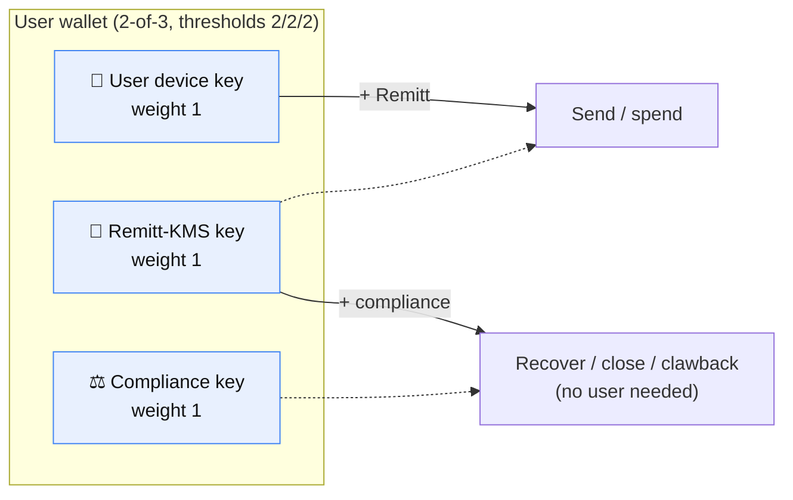
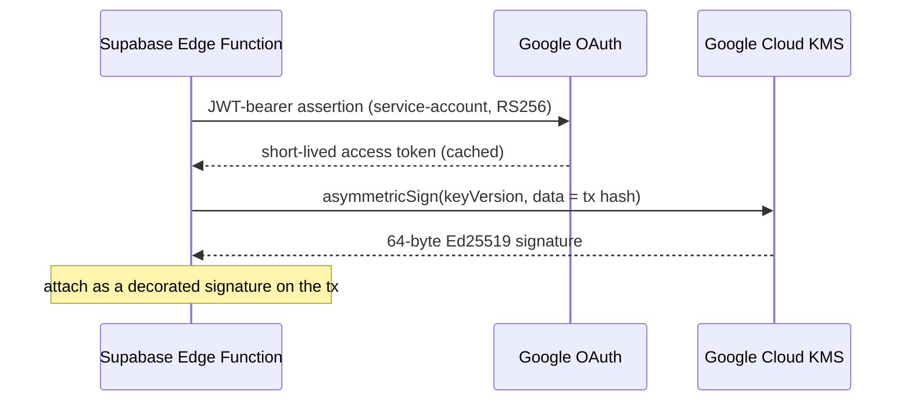
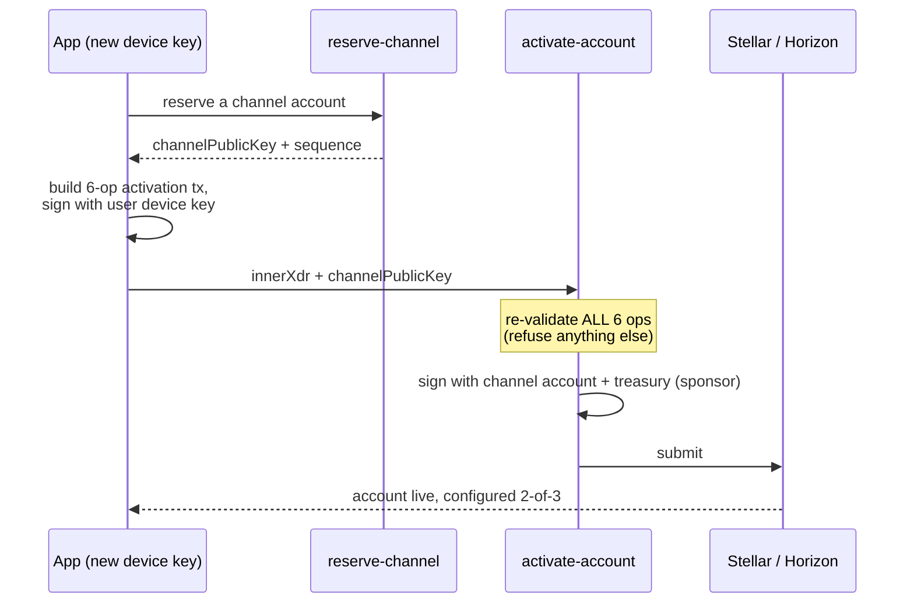
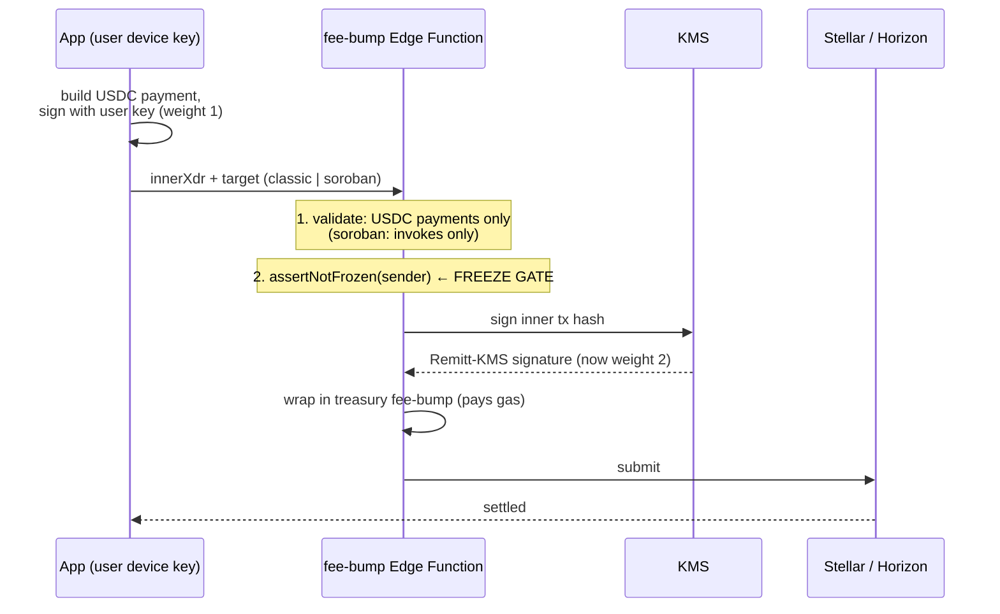
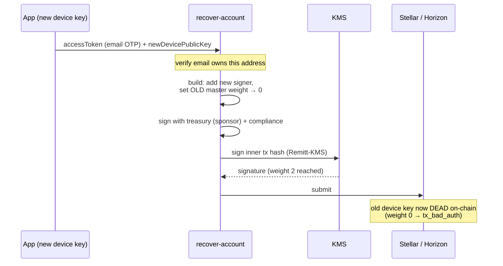
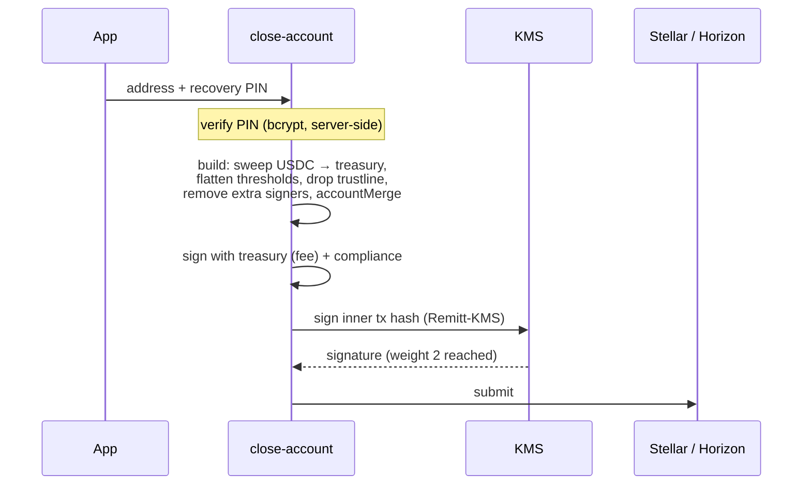
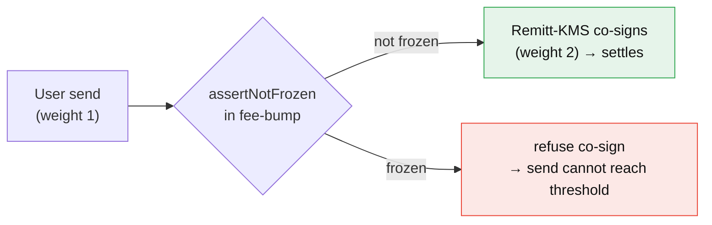

# Wallet Security & Key Custody

How Remitt secures user wallets with **2-of-3 multisig + Google Cloud KMS**, and
how each user flow (create, send, recover, close, freeze) is authorized.

> **TL;DR** — Every user wallet is a Stellar account with **three signers, each
> weight 1, and all thresholds set to 2**: the user's device key, a
> **Remitt** key held in Google KMS, and a **compliance** key. Any *two* can
> act; no *single* key can. The treasury only sponsors reserves and pays gas —
> it is **not** a signer on user accounts, so leaking it cannot move user funds.

---

## 1. The problem this solves

The original design gave the treasury a **weight-2 co-signer** slot on every
user account. That is a single point of failure: **if the treasury key leaked,
every user wallet could be drained.** It also meant the key that pays gas was
the same key that could move funds.

The 2-of-3 design removes that. No single key — not the user's, not Remitt's,
not the treasury's — can move funds alone.

---

## 2. The signing model

Each wallet is a classic Stellar account configured like this:

```
signers (each weight 1):        thresholds:
  • user device key   (w1)        low  = 2
  • Remitt-KMS key    (w1)        med  = 2
  • compliance key    (w1)        high = 2
master weight = 1 (the user)
```

Because every operation needs weight **2** and each key is weight **1**, every
action requires a **quorum of two** of the three keys.



| Quorum | Enables |
|--------|---------|
| user **+** Remitt-KMS | normal spending (P2P send, cash-out, Earn) |
| Remitt-KMS **+** compliance | recovery, close, clawback — **without the user** |
| user alone / Remitt alone / compliance alone | **nothing** (weight 1 < 2) |

### Roles at a glance

| Key | Where it lives | Purpose | Can it move funds alone? |
|-----|----------------|---------|--------------------------|
| **User device** | on the phone | the user's own authorization | ❌ |
| **Remitt-KMS** | Google Cloud KMS (private key never leaves) | co-signs sends; half of recovery/close | ❌ |
| **Compliance** | separate holder (KMS/external) | half of recovery/close/clawback | ❌ |
| **Treasury** | server (KMS on mainnet) | **sponsors reserves + pays gas only** — *not a signer* | ❌ (not a signer) |

---

## 3. Key custody: KMS, not secrets in the bundle

The Remitt signer's **private key never exists in the app bundle or in an
environment variable**. It is a `EC_SIGN_ED25519` key in Google Cloud KMS. The
server signs by sending the 32-byte transaction hash to KMS `asymmetricSign`
and getting back a 64-byte Ed25519 signature — the key material never leaves
the KMS boundary.



The signing key is referenced only by its **KMS resource name**
(`REMITT_KMS_KEY_VERSION`); auth is a **service-account JSON** (`GOOGLE_SA_JSON`)
used purely to obtain a token. Neither reveals the private key.

---

## 4. Flows

### 4.1 Create (activate-account) — *no KMS signature*

Account creation is **sponsored and gasless**: the user's account ends up
holding 0 XLM while the treasury sponsors the base + trustline + signer
reserves. This flow **configures** the account as 2-of-3 (it registers the
Remitt-KMS and compliance *public keys* as signers) but does **not** itself
call KMS to sign — it's authorized by the channel account + treasury.



The six operations (validated exactly by `assertIsActivation`):

1. `beginSponsoringFutureReserves` (treasury)
2. `createAccount` — 0 XLM (treasury)
3. `changeTrust` — USDC (new account)
4. `setOptions` — master weight 1, thresholds 2/2/2, **add Remitt-KMS** signer
5. `setOptions` — **add compliance** signer
6. `endSponsoringFutureReserves` (new account)

> On mainnet the on-ramp partner delivers USDC straight to the wallet once the
> trustline exists — the treasury never hands out USDC itself.

### 4.2 Send (fee-bump) — user **+ Remitt-KMS**

The user signs a payment on-device (weight 1). Because that alone is below the
threshold, the **fee-bump Edge Function is the single choke point** that adds
Remitt's KMS co-signature (weight 2) and pays the gas, then submits.



Two guardrails make the co-signature safe:

- **It is not a rubber stamp.** The function refuses to co-sign anything that
  isn't a USDC payment sourced from the sender (or, for Earn, a Soroban
  contract invoke). A stolen user key can't get Remitt to co-sign a
  `setOptions` re-key, an `accountMerge`, or a non-USDC transfer.
- **It is the freeze point** (see §5).

### 4.3 Recover — Remitt-KMS **+ compliance** (no user)

If a user loses their device, recovery swaps in a new device key **without the
old key**. Identity is proven out-of-band (email OTP + recovery PIN) before this
runs; the on-chain change is authorized by Remitt-KMS + compliance.



The old key is set to **weight 0**, so it is genuinely dead on-chain — not
merely "trusted to be deleted."

### 4.4 Close — Remitt-KMS **+ compliance** (no user)

Closing sweeps the balance, drops the trustline + extra signers, and merges the
account back to the treasury (works even for abandoned "ghost" accounts).
Gated by the recovery PIN.



> **Why removing our own signers mid-transaction is safe:** Stellar validates a
> transaction's signatures against the account state at the **start** of the
> transaction. So zeroing the Remitt-KMS + compliance signers in earlier
> operations does not invalidate the weight-2 authorization of the final
> `accountMerge`. (Verified on testnet.)

### 4.5 Freeze — Remitt *withholds* its co-signature

Freezing needs **no on-chain transaction**. Since every user send must be
co-signed by Remitt-KMS (§4.2), Remitt simply **refuses to co-sign** for a
frozen account — the user's weight-1 signature can never reach the threshold on
its own. The enforcement point is `assertNotFrozen()` inside the fee-bump
function.

Frozen addresses live in the `frozen_accounts` table (RLS-locked to the service
role). `assertNotFrozen` looks the sender up there before co-signing, and is
**fail-closed** — if the freeze list can't be read, it refuses to co-sign rather
than risk letting a frozen account through. The list is managed by the
**admin-only `set-freeze`** function (gated by a shared `ADMIN_SECRET` header,
not the anon key), which freezes/unfreezes by address. Freezing works for any
account, whether or not it has a profile row.



---

## 5. Security properties

What a single compromised key can and cannot do:

| Compromised key | Can drain a wallet? | Notes |
|-----------------|--------------------|-------|
| **User device key** | ❌ No | needs Remitt-KMS co-sign; fee-bump refuses non-USDC/non-send ops and can freeze |
| **Remitt-KMS key** | ❌ No | weight 1; needs the user (send) or compliance (recover/close) |
| **Compliance key** | ❌ No | weight 1; needs Remitt-KMS |
| **Treasury key** | ❌ No | not a signer on user accounts — only sponsors reserves / pays gas |
| **Remitt-KMS + compliance together** | ⚠️ Yes (by design) | this is the intended clawback/recovery power for compliance |

The remaining trust assumption is a **full Remitt-infrastructure breach**
(KMS-signing ability **and** the compliance key at once) — the deliberate
tradeoff for keeping clawback/recovery/freeze powers.

---

## 6. Deployment reference

- **Functions** (Supabase Edge, Deno): `activate-account`, `fee-bump`,
  `recover-account`, `close-account`; shared KMS helper at
  `supabase/functions/_shared/kms.ts`.
- **Secrets**: `GOOGLE_SA_JSON` (service-account JSON), `REMITT_KMS_KEY_VERSION`
  (KMS resource name), `COMPLIANCE_SECRET`, `TREASURY_SECRET`.
- **Reserves**: ~2.5 XLM per wallet (3 signers + trustline), fully refundable on
  close.

---

## 7. Migrating pre-2-of-3 wallets

Accounts created **before** this design are in the old shape (user/device key
w1 + **treasury weight-2 co-signer**, thresholds 1/1/2). A code change doesn't
alter accounts already on-chain, and the new functions attach a Remitt-KMS
signature that isn't a registered signer on old accounts — so old wallets must
be **converted**, not left as-is.

Because the treasury is a weight-2 signer on those accounts, **the treasury
alone can authorize the conversion** (one final, legitimate use of that power
before it's removed): a single treasury-signed transaction adds the Remitt-KMS
and compliance signers, sets thresholds to 2/2/2, and drops the treasury signer
to weight 0. `masterWeight` is left untouched, so already-recovered accounts
(master 0 + separate device signer) keep working. Verified against the
tx-start-snapshot rule, the treasury authorizes the whole transaction even
though its last operation removes itself.

> Done on testnet via a one-off `migrate-account` function (since deleted): all
> existing wallets converted and re-audited as working 2-of-3. **Mainnet has no
> pre-existing wallets**, so this migration is testnet-only — mainnet is 2-of-3
> from day one.

### Open hard walls before mainnet

1. **HSM protection level** — recreate the KMS signing key with
   `--protection-level hsm` (testnet uses `SOFTWARE`).
2. **Strip `TREASURY_SECRET` from the client** — move the remaining
   `treasuryPayment` (cash-in settlement) to a KMS-signed Edge Function so the
   bundle contains no treasury key at all.
3. **Rotate to fresh treasury keys** — the testnet treasury key was exposed
   during development; mainnet must use all-new, HSM-backed keys.
